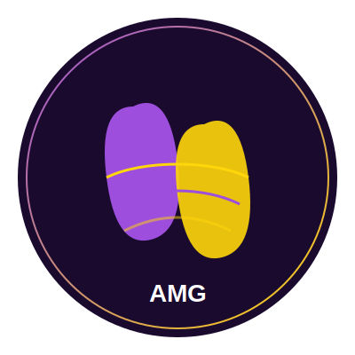

<div align="center">
  
</div>

# PumpMusic - AI Music Generation Platform

## Project Overview
PumpMusic is an innovative AI-powered music generation platform that allows users to create unique music tracks based on text prompts. The platform implements a token-based system where users can earn or purchase tokens to generate music.

## Official Links
- **Official Website**: [pumpmusic.fun](https://pumpmusic.fun)
- **Twitter**: [@pumpmusic_fun](https://x.com/pumpmusic_fun)

## Core Features
- **AI Music Generation**: Create original music tracks from text descriptions
- **Token Economy**: Users earn or purchase tokens to generate music
- **User Profiles**: Track generation history and manage tokens
- **Music Library**: Browse, play, and download generated tracks
- **Community Features**: Share and discover music created by other users

## Project Status
- **Current Phase**: Development
- **Frontend Progress**: 70% complete - Core UI components and pages implemented
- **Backend Progress**: 80% complete - API endpoints and database models established
- **AI Integration**: 50% complete - Basic generation functionality working
- **Next Steps**: Implement advanced music customization, enhance user experience, and optimize performance

## Architecture
The project follows a modern web application architecture:

### Frontend
- **Framework**: React.js (v18.2.0) for the user interface
- **State Management**: Redux with Redux Toolkit and Redux Thunk for asynchronous actions
- **Routing**: React Router v6 for navigation
- **API Communication**: Axios for HTTP requests
- **UI Components**: Custom components with responsive design
- **Audio**: HTML5 Audio API for music playback

### Backend
- **Server**: Node.js with Express.js (v4.18.2) for the API server
- **Database**: MongoDB with Mongoose ODM for data modeling and validation
- **Authentication**: JWT (jsonwebtoken) with bcryptjs for password hashing
- **Middleware**: CORS for cross-origin requests, Morgan for logging
- **Environment**: dotenv for environment variable management

### AI Music Generation
- **AI Integration**: OpenAI API for music generation capabilities
- **Processing**: Asynchronous processing queue for handling generation requests
- **Storage**: Generated music files stored with metadata references in MongoDB

## Installation

### Prerequisites
- Node.js (v14+)
- MongoDB (v4.4+)
- npm (v6+) or yarn (v1.22+)
- OpenAI API key (for music generation functionality)

### Setup Instructions

1. Clone the repository
```bash
git clone https://github.com/yourusername/pumpmusic.git
cd pumpmusic
```

2. Install dependencies
```bash
# Install backend dependencies
cd server
npm install

# Install frontend dependencies
cd ../client
npm install
```

3. Set up environment variables
```bash
# In the server directory, create a .env file with the following variables
MONGODB_URI=mongodb://localhost:27017/pumpmusic
JWT_SECRET=your_jwt_secret
PORT=5000
AI_MODEL_API_KEY=your_ai_model_api_key
```

4. Start the development servers
```bash
# Start the backend server
cd server
npm run dev

# In a new terminal, start the frontend server
cd client
npm start
```

## Project Structure

### Directory Organization
```
pumpmusic/
├── client/                 # Frontend React application
│   ├── public/             # Static files
│   └── src/                # Source code
│       ├── components/     # Reusable UI components
│       │   ├── Footer.js
│       │   ├── Navbar.js
│       │   └── PrivateRoute.js
│       ├── pages/          # Page components
│       │   ├── CreateMusic.js
│       │   ├── Dashboard.js
│       │   ├── Home.js
│       │   ├── Login.js
│       │   ├── MusicLibrary.js
│       │   ├── Profile.js
│       │   ├── Register.js
│       │   └── TokenPurchase.js
│       ├── redux/          # State management
│       │   ├── slices/     # Redux Toolkit slices
│       │   │   ├── authSlice.js
│       │   │   ├── musicSlice.js
│       │   │   └── tokenSlice.js
│       │   └── store.js    # Redux store configuration
│       ├── App.js          # Main application component
│       └── index.js        # Application entry point
├── server/                 # Backend Node.js application
│   ├── src/                # Source code
│   │   ├── middleware/     # Express middleware
│   │   │   └── auth.js     # Authentication middleware
│   │   ├── models/         # Mongoose data models
│   │   │   ├── Music.js    # Music track model
│   │   │   ├── Token.js    # User token model
│   │   │   └── User.js     # User account model
│   │   ├── routes/         # API routes
│   │   │   ├── auth.js     # Authentication routes
│   │   │   ├── music.js    # Music generation routes
│   │   │   ├── tokens.js   # Token management routes
│   │   │   └── user.js     # User profile routes
│   │   └── index.js        # Server entry point
│   └── .env                # Environment variables
└── README.md               # Project documentation
```

## Usage

1. Register an account or log in
2. Navigate to the "Create" page
3. Enter a text prompt describing the music you want to generate
4. Use tokens to generate the music
5. Listen to, download, or share your generated track

## API Documentation

### Authentication
- `POST /api/auth/register` - Register a new user
  - Request: `{ username, email, password }`
  - Response: `{ token, user: { id, username, email } }`
- `POST /api/auth/login` - Log in a user
  - Request: `{ email, password }`
  - Response: `{ token, user: { id, username, email } }`

### User
- `GET /api/user/profile` - Get user profile
  - Headers: `Authorization: Bearer {token}`
  - Response: `{ id, username, email, createdAt, musicCount }`
- `PUT /api/user/profile` - Update user profile
  - Headers: `Authorization: Bearer {token}`
  - Request: `{ username, email, password (optional) }`
  - Response: `{ id, username, email, updatedAt }`

### Tokens
- `GET /api/tokens/balance` - Get user token balance
  - Headers: `Authorization: Bearer {token}`
  - Response: `{ balance, transactions }`
- `POST /api/tokens/purchase` - Purchase tokens
  - Headers: `Authorization: Bearer {token}`
  - Request: `{ amount, paymentMethod, paymentDetails }`
  - Response: `{ success, newBalance, transactionId }`

### Music Generation
- `POST /api/music/generate` - Generate music from a prompt
  - Headers: `Authorization: Bearer {token}`
  - Request: `{ prompt, title, genre, mood, isPublic }`
  - Response: `{ id, title, audioUrl, createdAt }`
- `GET /api/music/history` - Get user's generation history
  - Headers: `Authorization: Bearer {token}`
  - Query: `?page=1&limit=10&sort=createdAt:desc`
  - Response: `{ tracks: [...], totalCount, page, limit }`
- `GET /api/music/library` - Get public music library
  - Query: `?page=1&limit=10&genre=pop&mood=happy&sort=createdAt:desc`
  - Response: `{ tracks: [...], totalCount, page, limit }`

## Development Workflow

### Backend Development
1. Create or modify models in `server/src/models/`
2. Implement route handlers in `server/src/routes/`
3. Add middleware as needed in `server/src/middleware/`
4. Test API endpoints using Postman or similar tools

### Frontend Development
1. Create or modify Redux slices in `client/src/redux/slices/`
2. Implement UI components in `client/src/components/`
3. Create or update pages in `client/src/pages/`
4. Test UI functionality in the browser

## Contributing
Contributions are welcome! Please follow these steps:

1. Fork the repository
2. Create a feature branch: `git checkout -b feature/amazing-feature`
3. Commit your changes: `git commit -m 'Add some amazing feature'`
4. Push to the branch: `git push origin feature/amazing-feature`
5. Open a Pull Request

### Coding Standards
- Follow ESLint configuration for code style
- Write meaningful commit messages
- Include tests for new features when possible
- Update documentation as needed

## License
This project is licensed under the MIT License - see the LICENSE file for details.

## Acknowledgements
- Thanks to all the open-source libraries that made this project possible
- Special thanks to the AI music generation research community
- OpenAI for providing the AI capabilities
- MongoDB for the flexible data storage solution